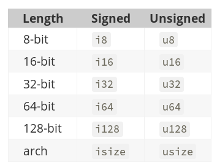
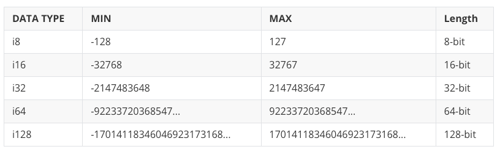
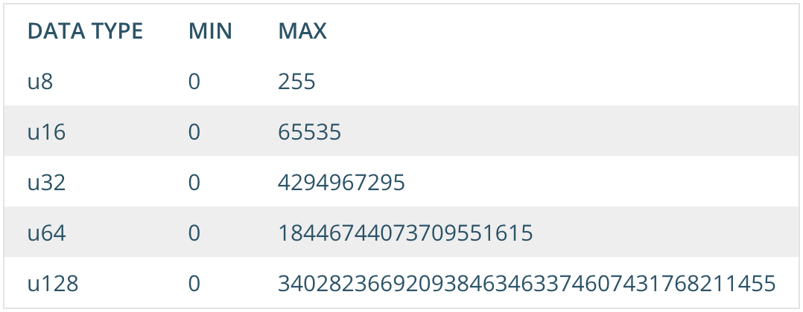

# hello-rust

## Variables

Las variables en rust son inmutables (no pueden modificarse) tanto en su valor como es su tipo, para hacer una variable mutable se debe agregar la palabra reservada mut y el tipo de dato se debe mantener

### Strings

Rust maneja mas de dos tipos de datos con respecto a los strings que se puede ver en su propia [documentacion](https://doc.rust-lang.org/book/ch08-02-strings.html)

&str es un tipo de dato que se refiere a una referencia a un string, es decir que no es un string en si, sino que es una referencia a un string que se encuentra en otra parte de la memoria, por lo que no se puede modificar

String es un tipo de dato que se refiere a un string en si, es decir que es un string que se encuentra en la memoria, por lo que se puede modificar

### Numéricos

Los tipos de datos relacionados con numeros pueden ser definidos sin signo y con signo, es decir que se puede limitar el uso inecesario de bits en memoria como por ejemplo con una variable para la edad que no puede ser negativa y para los humanos normalente no puede superar el valor de 100 o sea que el tipo de dato mas apropiado es u8

Al manejar un número definido de bits, cada variable puede albergar hasta un cierto número de valor (Por ejemplo, si tratáramos de guardar un 256 en una variable de tipo u8, me saltaría error de Out of range (Fuera de rango)



La diferencia entre los signed y unsigned, es que estos últimos solo utilizan su capacidad para almacenar números positivos, mientras que los signed lo usan para una cantidad igual de números positivos y negativos.




## Unwrap

la mayoría de las operaciones para entrada o salida devuelven el tipo Result<T, E>, el cual es un tipo que suele ser usado para retornar y propagar errores. Es un enum con las variantes, Ok(T), para representar el caso de éxito y contiene un valor, y Err(E), el cual representa que ocurrió un error y contiene el valor de dicho error.

``` rust
enum Result<T, E> {
   Ok(T),
   Err(E),
}
```

Una vez entendido esto, unwrap lo que hace es extraer el valor en caso de éxito, pero, dado que en la operación de entrada o salida podemos obtener un error,
